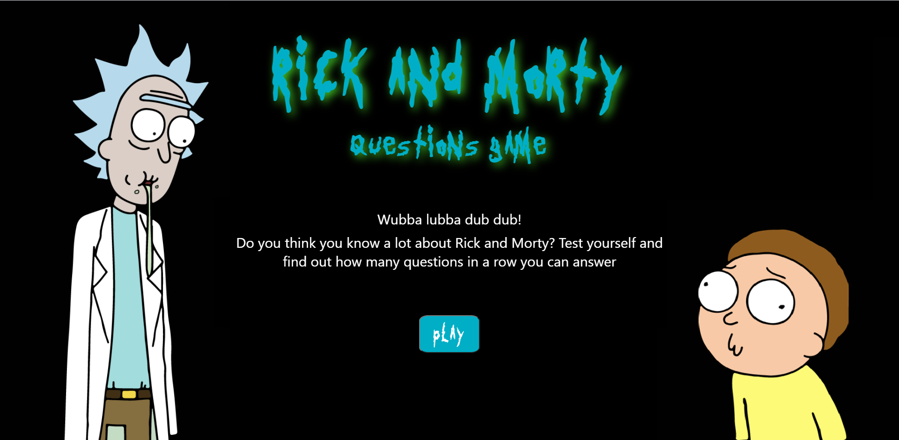
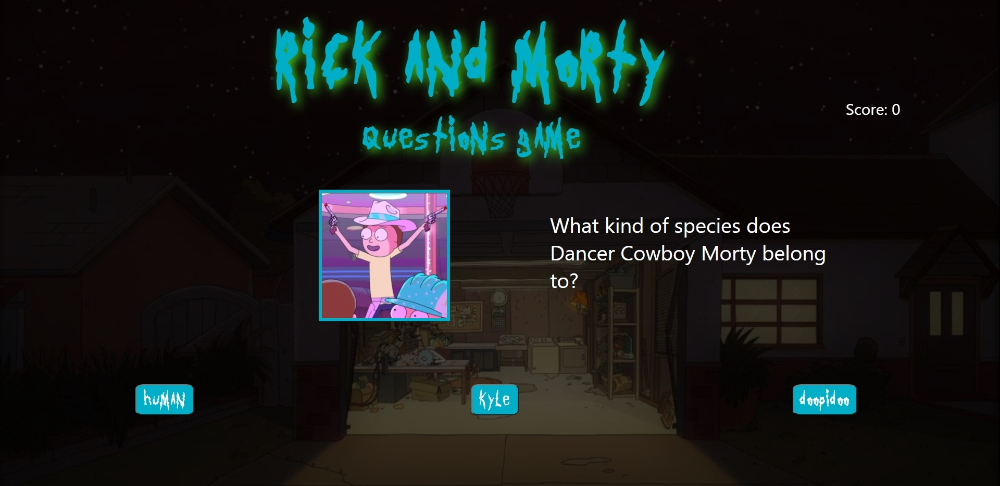
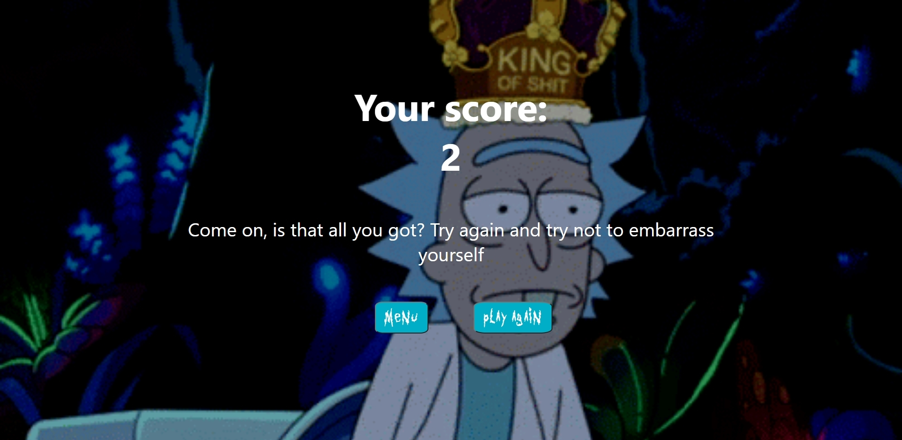

# Rick and Morty Questions Game

The goal of this project is to implement a Rick and Morty website where fans of the show can answer random questions about the characters. 

For each correct answer the user will earn a point. The final score page will show when the user fails a question.

You can visit the website through the following link: [https://rickandmortyquestionsgame.web.app/]

## Screenshots

The following images show the screens of the web application:

**Home page**

**Questions page**

**Score page**

## Technologies

This project was developed using React, since it has helped me to gain experience with this framework.

## Support

If you find any bug or want to give some feedback, feel free to email me! (diegojaraoro@gmail.com)
